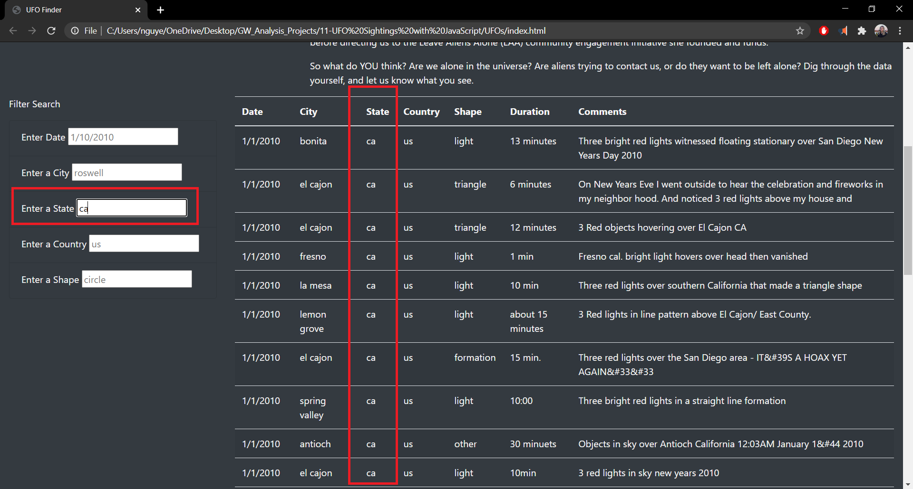

# UFO Sightings

## Overview of Project: 

The purpose of this project is to help Dana, a data journalist, who would like to gather and display information about UFO sightings around the country. With the increasing amount of data, Dana would like the users to be able to filter the data depending on their specific search criteria. 

## Results: 
Users can easily filter out UFO sightings data by typing their criteria in each input box. Below are step-by-step instructions and images to guide the user.
1. Open up the [index.html](https://github.com/nguyencao247/UFOs/blob/main/index.html) file in your web browser. You should see the webpage below:

2. Scroll down and navigate to the ‘Filter Search’ section on the left side of the webpage. 

3. Choose a criteria and enter in the input box what you would like to filter from the webpage as shown below. For example, if you only want to see sightings from the state of California, simply enter ‘ca’ in the empty text box. 

4. Next, either click ‘Enter’ on your keyboard or click anywhere on the webpage.

5. The webpage will sense a change and the table of all the UFO sightings data will update with the filter criteria indicated. 

6. If the user would like to filter the data even further, they can enter multiple criteria (just follow steps 3-5). Below is an example of using two criteria for sightings from the state of California and shape of triangle. 

## Summary: 

One drawback of this design is that there is no ‘clear’ button. If the user wants to clear their filtered search they would have to refresh the page. This isn’t always intuitive.

Two recommendations for further development includes the following:
- Use a drop-down menu instead of a free text input box. This would prevent data validation issues from user error. Providing the user with a selection of the filters that are available will prevent errors in the webpage.
- Additional sorting functionality on each column should be added so that users can view the data depending on their needs. For example, the user may want to only see the most recent UFO sightings and not in a random order. 
